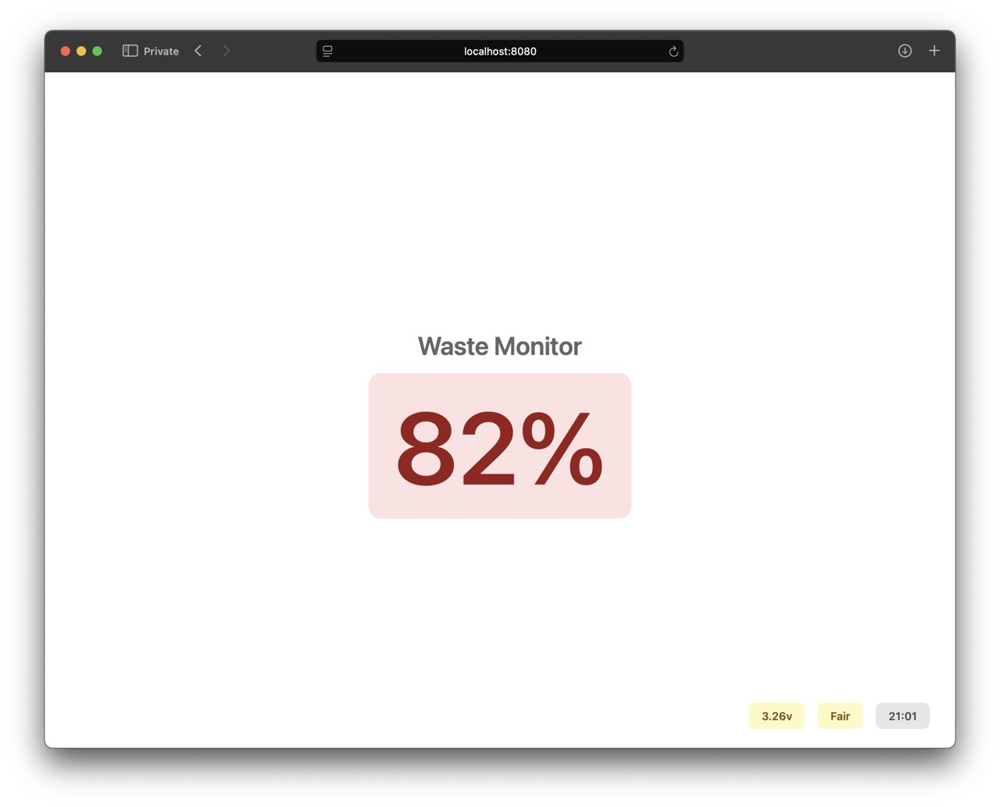

# waste-monitor

simple waste bin monitoring system using [LoRa](https://en.wikipedia.org/wiki/LoRa) and ultrasonic sensors



## Overview

- monitors waste bin fill percentage, battery status, and signal strength
- realtime updates with [SSE](https://en.wikipedia.org/wiki/Server-sent_events)
- LoRa for longer range communication
- data persistence with sqlite
- tiny interface and only sqlite for dependencies

bin ultrasonic -- bin esp32 --> gateway esp32 -- WiFi --> server -- SSE --> browser

### 🚧 Bin sensor

- within the waste bin and battery powered
- ESP32 with LoRa module
- ultrasonic sensor with deep sleep and waterproofing
- sends readings every 30 minutes

### 🚧 Gateway

- within building in line of sight of the bin, with network access
- ESP32 with LoRa module
- receives LoRa signals and forwards them to server

### Server

- go backend with sqlite
- instant delivery of bin sensor readings via SSE

## Development

use the Makefile for easy dev

```sh
make run      # run development server
make build    # build binary
make test     # test out the sse and interface
make clean    # remove binary and db
```

### Test

to test the events sending to the frontend you can run `make build` in one terminal and `make test` from another and load up `http://localhost:8080` to see as the events send and update the site.